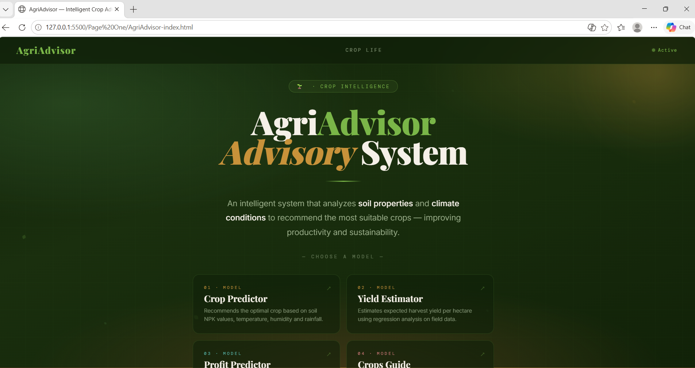
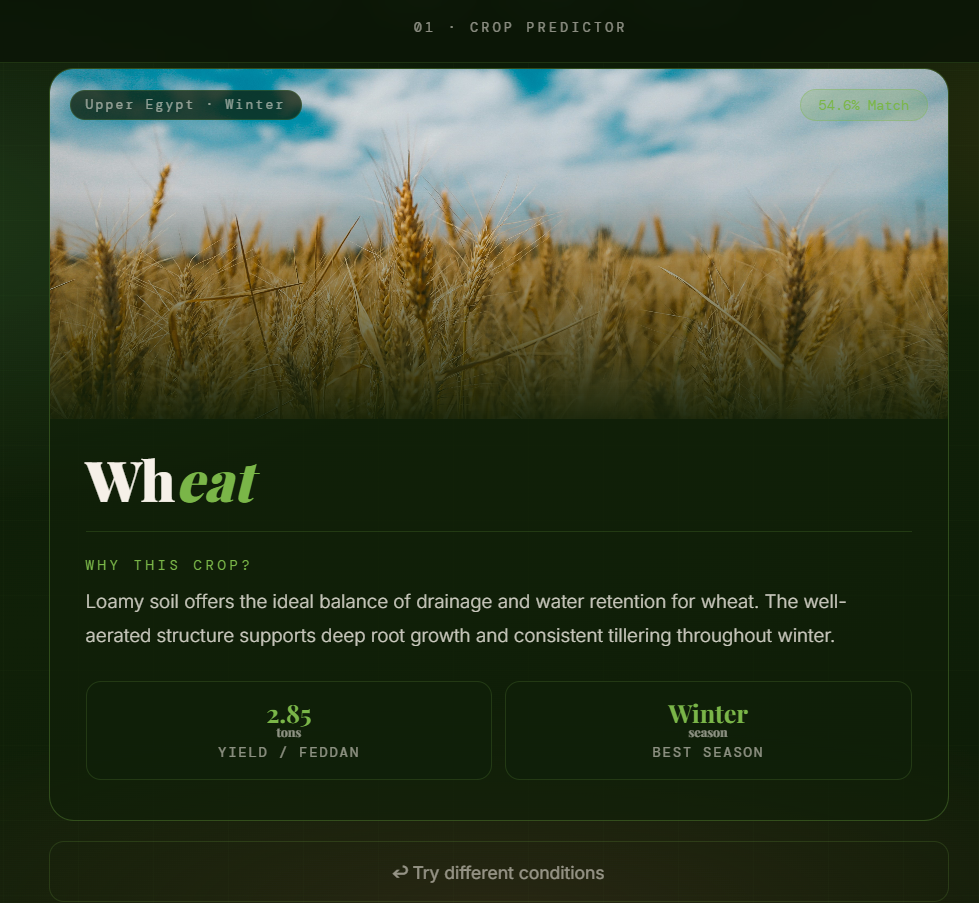
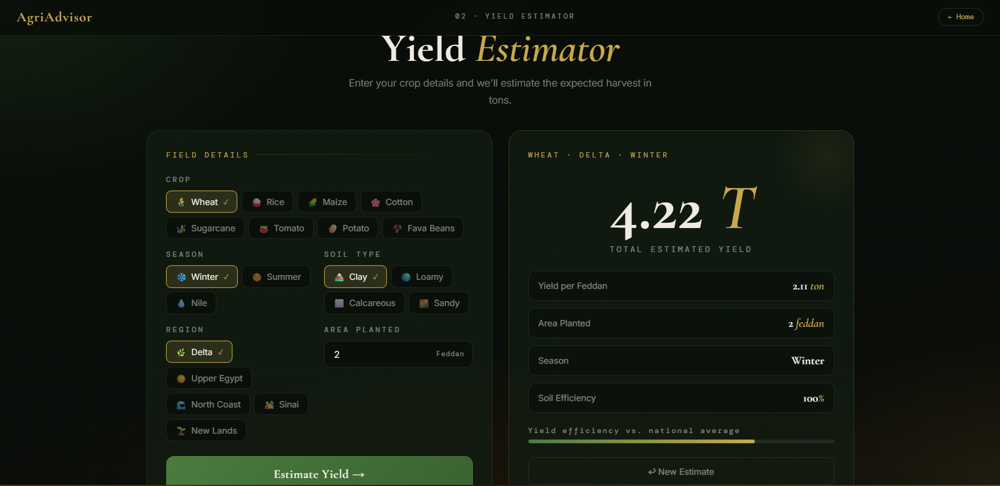
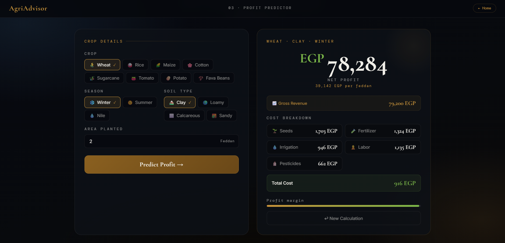

# 🌾 AgriAdvisor

> An AI-powered agricultural advisory web application that helps Egyptian farmers make data-driven decisions about crop selection, yield estimation, and profit forecasting.

---

## 📋 Table of Contents

- [Overview](#overview)
- [Features](#features)
- [Tech Stack](#tech-stack)
- [Project Structure](#project-structure)
- [Getting Started](#getting-started)
- [API Reference](#api-reference)
- [ML Models](#ml-models)
- [Screenshots](#screenshots)

---

## Overview

AgriAdvisor is a graduation project that combines machine learning with a web interface to assist farmers across Egypt. Users can input soil type, region, season, and land area to receive intelligent recommendations powered by trained ML models.

The backend is built with **FastAPI** and serves three prediction endpoints. The frontend consists of five HTML pages — a landing page, three tool pages, and a crop guide.

---

## Features

| Page | Feature | ML Model |
|------|---------|----------|
| Page 2 — Crop Recommender | Recommends the best crop based on soil, region, and season | LightGBM / XGBoost classifier |
| Page 3 — Yield Estimator | Estimates yield in tons per feddan | SVR / Random Forest regressor |
| Page 4 — Profit Calculator | Forecasts expected profit in EGP | XGBoost regressor (R²=0.93) |
| Page 5 — Crop Guide | Static guide for 8 major Egyptian crops | — |

**Supported crops:** Wheat, Rice, Maize, Cotton, Sugarcane, Tomato, Potato, Fava Beans

---

## Tech Stack

**Backend**
- Python 3.x
- FastAPI
- Uvicorn
- scikit-learn, XGBoost, LightGBM
- joblib

**Frontend**
- HTML5 / CSS3 / JavaScript (Vanilla)
- Fetch API for backend communication

---

## Project Structure

```
Website_Project/
│
├── main.py                          ← FastAPI entry point
│
├── routers/
│   ├── crop.py                      ← POST /crop/predict
│   ├── yield_.py                    ← POST /yield/predict
│   └── profit.py                    ← POST /profit/predict
│
├── ml_models/
│   ├── crop.py                      ← Crop inference logic + CLIMATE_DEFAULTS
│   ├── yield_.py                    ← Yield inference logic
│   └── profit.py                    ← Profit inference logic
│
├── Page One/
│   └── AgriAdvisor-index.html       ← Landing page
│
├── Page Two/
│   ├── page2.html                   ← Crop Recommender UI
│   ├── Images/                      ← Crop photos (8 images)
│   └── models/
│       ├── crop_model.pkl           ← Trained classifier
│       └── crop_recommendation.csv  ← Training dataset (7,000 rows)
│
├── Page Three/
│   ├── AgriAdvisor-page3-yield.html ← Yield Estimator UI
│   └── Model/
│       ├── yield_model.pkl          ← Trained regressor
│       └── egypt_yield_8400.csv     ← Training dataset (8,400 rows)
│
├── Page Four/
│   ├── AgriAdvisor-page4-profit.html ← Profit Calculator UI
│   └── Model/
│       ├── profit_model.pkl          ← Active model (XGBoost)
│       └── profit_estimation_10k.csv ← Training dataset (10,400 rows)
│
└── Page Five/
    ├── AgriAdvisor-page5-guide.html  ← Crop Guide
    └── images/                       ← 32 crop photos (4 per crop)
```

---

## Getting Started

### Prerequisites

```bash
pip install fastapi uvicorn scikit-learn xgboost lightgbm joblib
```

### Run the Server

```bash
cd Website_Project
uvicorn main:app --reload
```

The API will be available at `http://localhost:8000`

Interactive API docs: `http://localhost:8000/docs`

### Open the Frontend

Open `Page One/AgriAdvisor-index.html` in your browser and navigate from there.

> **Note:** The frontend connects to `http://localhost:8000` by default. Make sure the FastAPI server is running before using any of the tool pages.

---

## API Reference

### `POST /crop/predict`

Recommends the best crop for given conditions.

```json
{
  "region": "Delta",
  "season": "Winter",
  "soil": "Clay"
}
```

### `POST /yield/predict`

Estimates yield per feddan and total yield.

```json
{
  "crop": "Wheat",
  "season": "Winter",
  "region": "Delta",
  "soil": "Clay",
  "area_feddans": 5
}
```

**Response includes:** `yield_per_feddan`, `total_yield`, `soil_efficiency`, `bar_pct`

### `POST /profit/predict`

Calculates expected profit.

```json
{
  "crop": "Wheat",
  "season": "Winter",
  "region": "Delta",
  "soil": "Clay",
  "area_feddans": 5
}
```

All endpoints return `400` for invalid crop–season or crop–soil combinations.

---

## ML Models

### Crop Recommender (Page 2)
- **Algorithm:** LightGBM / XGBoost (classifier)
- **Input features:** 11 features built from 3 user inputs via `CLIMATE_DEFAULTS` lookup table
- **Dataset:** 7,000 rows — `crop_recommendation.csv`
- **Training notebooks:** `SVM.ipynb`, `LightGBM.ipynb`, `XGBoost.ipynb`

### Yield Estimator (Page 3)
- **Algorithm:** SVR / Random Forest (regressor)
- **Dataset:** 8,400 rows — `egypt_yield_8400.csv`
- **Training notebooks:** `SVR.ipynb`, `RandomForest.ipynb`

### Profit Calculator (Page 4)
- **Algorithm:** XGBoost regressor — **R² = 0.93**
- **Dataset:** 10,400 rows — `profit_estimation_10k.csv`
- **Training notebooks:** `LightGBM.ipynb`, `XGBoost.ipynb`

> All models fall back to a demo/lookup-table mode if the `.pkl` file is not found, so the app stays functional for testing.

> The trained model files are included in the repository and loaded automatically on startup.

---

## Screenshots

### Landing Page
<!-- Homepage image (Page One) -->


### Crop Recommender
<!-- Image of the crop recommendation result (Page Two) -->


### Yield Estimator
<!-- Image of the productivity estimation result (Page Three) -->


### Profit Calculator
<!-- Image of the profit calculation result (Page Four) -->


---

## .gitignore Recommendations

```
*.pkl
__pycache__/
*.pyc
```

---

## Authors

Built as a graduation project by **Ramez Malak** — Arab Open University (AOU).

---

## License

This project is for academic purposes only.
